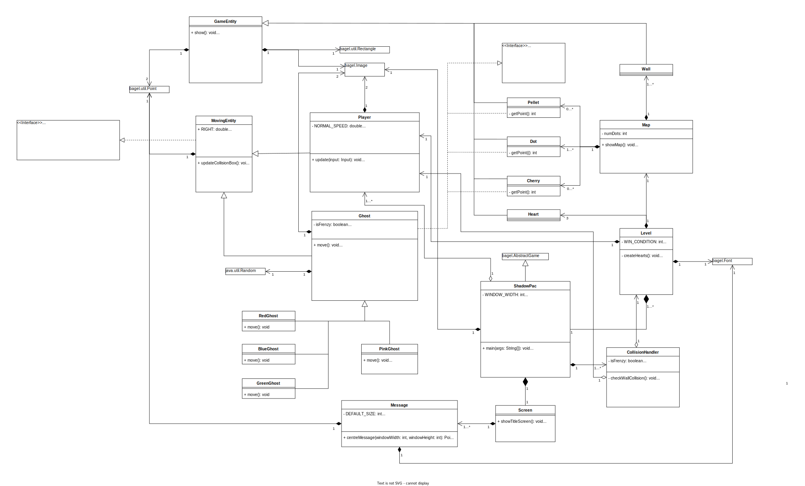
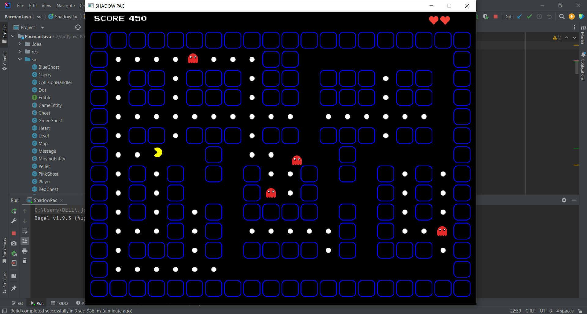
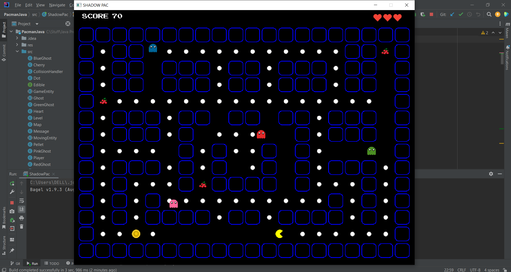
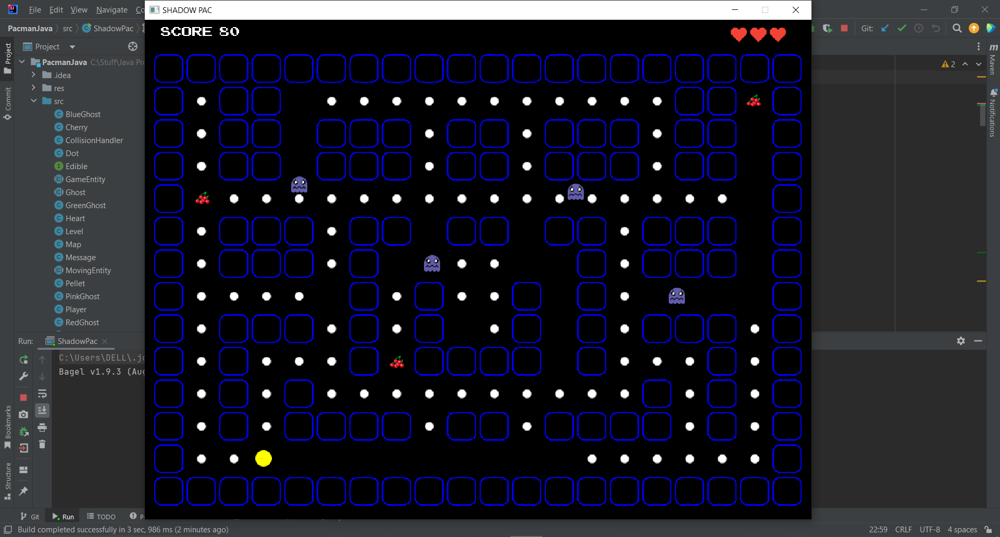

# PacmanJava

A variation of the classic arcade game Pacman.\
This was created for Project 2 of SWEN20003 Semester 1, 2023 at The University of Melbourne.

* First level: 
    * stationary enemies
    * eating white dots gives pacman points

* Second level: 
    * moving enemies with varying speeds & move pattern
    * cherry edibles provide more points than regular white dots
    * grabbing the coin provides pacman the ability to eat enemies

# What I Learned
* Object-Oriented Programming using Java
* Real application of Inheritance and Java Interfaces
* Using Maven to manage dependencies

# UML Diagram 

This shows the planning process before I started coding.

# Game Screenshots

## Level 1

## Level 2

## Level 2 - Pacman can eat enemies

